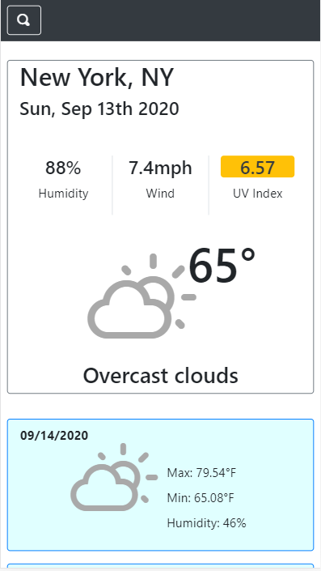

# Weather Dashboard

Link: https://meemofu.github.io/weather-forecast/

## Preview

# Desciption

This is a simple web application that provides weather forecast on any city you search. The interface is built with bootstrap, while the scipt uses jQuery. When a user search for a city, the field will suggest some autocomplete with Geobyte API. When a city is selected and search, the website will then make a request to Open Weather to get the forecast for that city. The city search will then be stored in the browser local storage, making it easier to search the same city again.

## Usage

To install this application, simply clone this github to your desktop and open the html file with your browser.
